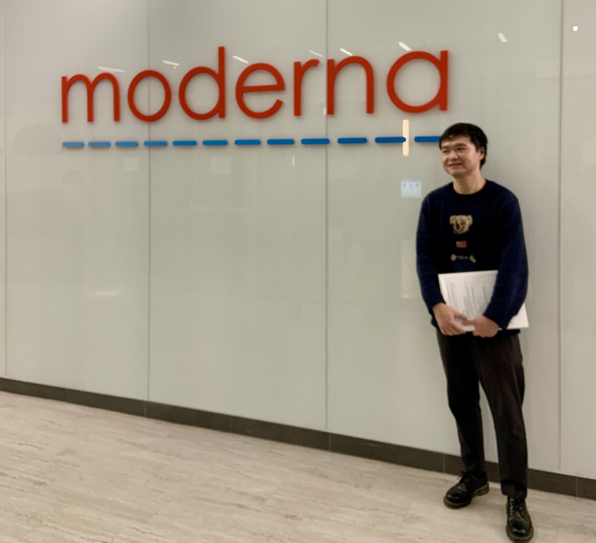

 

### Contact  
[Department of Electrical & Computer Engineering](https://engineering.tamu.edu/electrical)  
[Texas A&M University](http://www.tamu.edu)  
Email: yjyang027 [at] tamu.edu  
 

<!-- ### My 101 -->
Hello, my name is Yongjian Yang (杨　永健). I am currently a final-year Ph.D. student in electrical and computer engineering at Texas A&M University, where I am researching on computation biology with machine learning in [Cailab](https://cailab-tamu.github.io) under the supervision of [Dr. James Cai](https://engineering.tamu.edu/electrical/profiles/james-cai.html).  
Before returning to campus, I worked in Japan and gained valuable experience within the healthcare industry [see my [patent](https://patents.google.com/patent/US11511246B2/en)]. This experience has taught me to be a quick learner with excellent time/task management skills, which has enabled me to participate in a variety of R&D projects. In addition, I am a team player with cooperative skills honed through working with individuals of diverse backgrounds and cultures. 日本語も喋ります。 
I believe that my desire to solve difficult problems and my innovative critical thinking will be beneficial to the areas on which I am concentrating my efforts.
 

### Recent news
* **Feb 2024:** Joined Sanofi as a Data Scientist
* **Dec 2023:** Completed internship at Moderna
<!--  -->
* **Sep 2023:** My research article on interpretable modeling of gene-protein has been accepted by **Briefings in Bioinformatics** (IF: 13.99) [\[Paper\]](https://academic.oup.com/bib/article-abstract/24/6/bbad342/7291995) [\[Code\]](https://github.com/yjgeno/Multimodal_22)
* **July 2023:** Starting an intern position at Computational Science, [Moderna](https://www.modernatx.com/en-US)
* **June 2023:** Contributed as a Reviewer for [ACM-BIB 2023](https://acm-bcb.org)
* **June 2023:** My abstract on gene-protein modeling has been accepted by [2023 ICML Workshop on Computational Biology](https://icml-compbio.github.io/)
* **May 2023:** My research article on interpretable modeling of gene-protein is now available at [bioRxiv](https://www.biorxiv.org/content/10.1101/2023.05.16.541011v2)
* **May 2023:** My research article on virtual gene knockout (GenKI) is now online at **Nucleic Acids Research** (IF: 19.16) [\[Paper\]](https://doi.org/10.1093/nar/gkad450) [\[Code\]](https://github.com/yjgeno/GenKI)
* **Mar 2023:** Thrilled to receive the Electrical and Computer Engineering Travel Grant for [RECOMB 2023](http://recomb2023.bilkent.edu.tr) and presented my work
* **Feb 2023:** My research article scTenifoldXct on cell-cell communication is now online at **Cell Systems** (Cell Press, IF: 11.09) [\[Paper\]](https://www.cell.com/cell-systems/pdf/S2405-4712(23)00030-3.pdf) [\[Code\]](https://github.com/cailab-tamu/scTenifoldXct)
* **Nov 2022:** Presented my work at TAMIDS 2022 Scientific Machine Learning (SciML) Workshop
* **Oct 2022:** Presented my work at 3rd Annual GCC Single Cell Omics Symposium
* **Aug 2022:** Thrilled to receive the Texas A&M Institute of Data Science Travel Grants for [ICIBM 2022](https://icibm2022.iaibm.org) and presented my work
* **Mar 2022:** Our work scTenifoldKnk on virtual gene knockout is now online at [Patterns](https://www.sciencedirect.com/science/article/pii/S2666389922000010) [\[Code\]](https://github.com/cailab-tamu/scTenifoldKnk)
* **Jan 2022:** My research article on the Aryl Hydrocarbon Receptor is now online at [Cancer Prevention Research](https://aacrjournals.org/cancerpreventionresearch/article/15/1/17/675000) and featured as cover image
* **Oct 2021:** Presented my work at 2nd Annual GCC Single Cell Omics Symposium
 
 

### More about me
I am a big football (soccer) fan, and I was fortunate enough to watch the 2018 World Cup final in Russia. In US, I rise early on the weekends to watch the Premier League, from the thrill of a last-second goal to the tactical battles. 
I also like exploring different tonkotsu (豚骨) ramen restaurants in Japan and around world. There is something truly special about the rich, savory broth and tender noodles that keep me coming back for more.