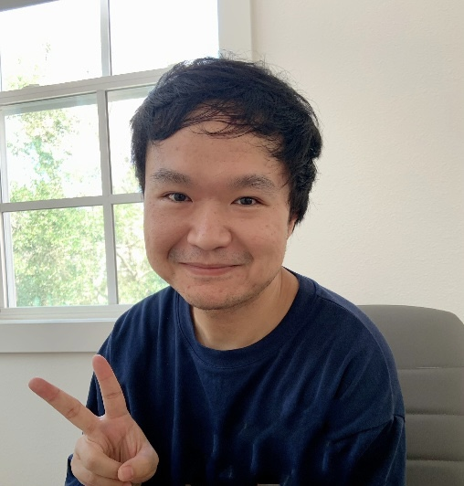

 

### Contact  
[Department of Electrical & Computer Engineering](https://engineering.tamu.edu/electrical)  
[Texas A&M University](http://www.tamu.edu)  
Email: yjyang027 [at] tamu.edu  
 

Hello, my name is Yongjian Yang (杨　永健). I am currently a 4th year Ph.D. student in electrical and computer engineering at Texas A&M University, where I am researching on computation biology with machine learning advised by [Dr. James Cai](https://engineering.tamu.edu/electrical/profiles/james-cai.html) in [Cailab](https://cailab-tamu.github.io). My research has provided me with a thorough understanding of the interface between computer science and biology, as well as skills in data analysis, programming, and statistical modeling.

On the other hand, working in the healthcare industry in Japan has taught me to be a quick learner with excellent time/task management skills, allowing me to participate in a variety of R&D projects. I am also a team player with cooperative skills gained from working with people from various backgrounds and cultures. 日本語も喋ります。

I believe that my desire to solve difficult problems and my innovative critical thinking will be beneficial to the areas on which I am concentrating my efforts.
 
 

### Recent news
* **Mar 2023:** Thrilled to receive the Electrical and Computer Engineering Travel Grant for [RECOMB 2023](http://recomb2023.bilkent.edu.tr).
* **Feb 2023:** My research article scTenifoldXct on cell-cell communication is now online at [Cell Systems](https://www.cell.com/cell-systems/pdf/S2405-4712(23)00030-3.pdf). [\[Python code\]](https://github.com/cailab-tamu/scTenifoldXct)
* **Nov 2022:** Presented my work at TAMIDS 2022 Scientific Machine Learning (SciML) Workshop.
* **Oct 2022:** Presented my work at 3rd Annual GCC Single Cell Omics Symposium.
* **Aug 2022:** Thrilled to receive the Texas A&M Institute of Data Science Travel Grants for ICIBM 2022.
* **Mar 2022:** Our work scTenifoldKnk on virtual gene knockout is now online at [Patterns](https://www.sciencedirect.com/science/article/pii/S2666389922000010). [\[R code\]](https://github.com/cailab-tamu/scTenifoldKnk)
* **Jan 2022:** My research article on the Aryl Hydrocarbon Receptor is now online at [Cancer Prevention Research](https://aacrjournals.org/cancerpreventionresearch/article/15/1/17/675000) and featured as cover image.
* **Oct 2021:** Presented my work at 2nd Annual GCC Single Cell Omics Symposium.
 
 

### More about me
I am a big football (soccer) fan, and I was fortunate enough to watch the 2018 World Cup final in Russia. In US, I rise early to watch the Premier League, from the thrill of a last-second goal to the tactical battles on the weekends. 
I also like exploring different tonkotsu (豚骨) ramen restaurants in Japan and around world. There is something truly special about the rich, savory broth and tender noodles that keep me coming back for more.